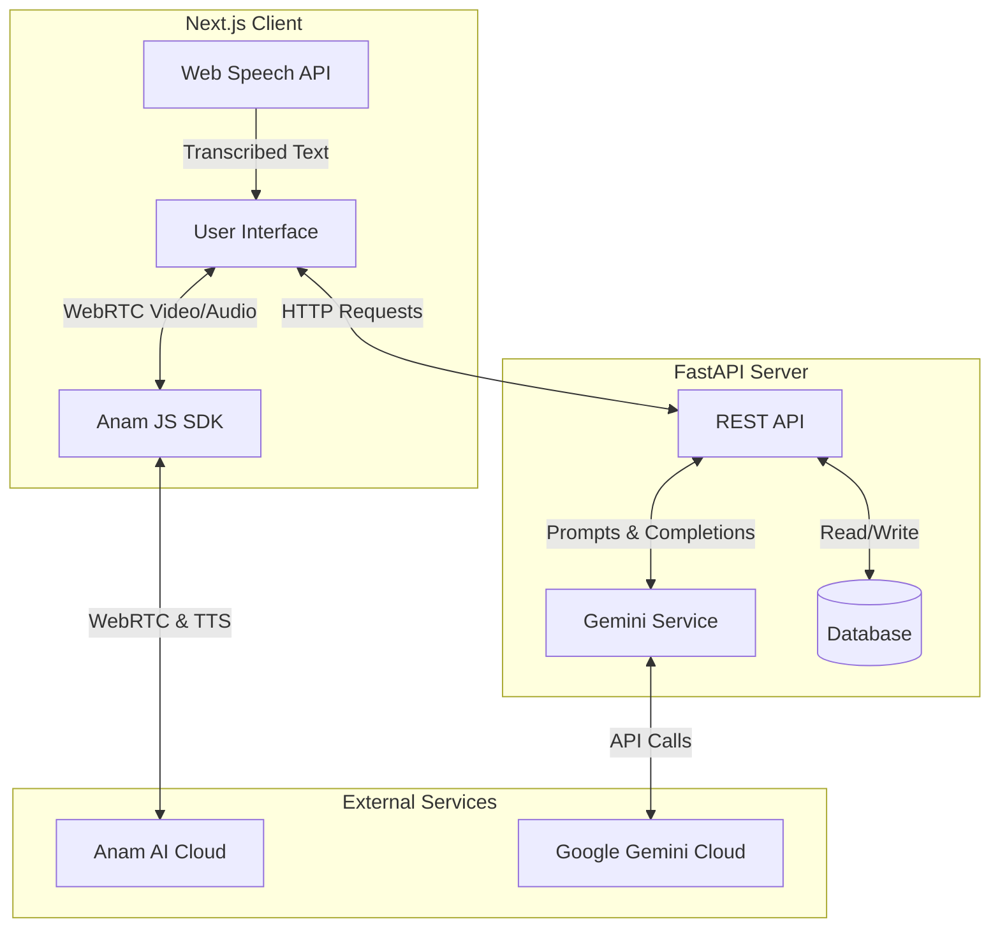
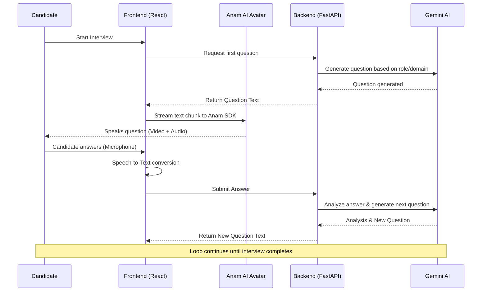

# 🚀 Maja (Ecosphere) - AI-Powered Interview Platform


Maja is a next-generation AI-powered mock interview platform that revolutionizes how candidates prepare for jobs and how organizations screen talent. By combining **Anam AI** for hyper-realistic video avatars and **Google Gemini** for adaptive, intelligent questioning, Maja provides a dynamic and stress-free interview experience.

---

## ✨ Key Features
- **Real-Time Video AI Avatars**: Powered by the `@anam-ai/js-sdk`, offering a human-like interviewer experience with synchronized lip movements and emotion.
- **Adaptive AI Inquiries**: Uses Google Gemini to analyze candidate responses and generate context-aware follow-up questions dynamically.
- **Semantic Barge-In & VAD**: Uses browser SpeechRecognition with voice activity detection, allowing candidates to interrupt the AI seamlessly.
- **Role-Based Dashboards**: Distinct interfaces for **Candidates** (to track performance and reports) and **Organizations** (to manage roles and review candidates).
- **Live Transcripts & Analysis**: Synchronized real-time interview transcripts.

---

## 🏗️ Architecture

Below is the high-level architecture diagram demonstrating how the frontend, backend, and external AI services interact.



---

## 🔄 Interview Flow



---

## 🛠️ Tech Stack

- **Frontend**: Next.js 14, React, Tailwind CSS, Lucide Icons
- **Backend**: Python, FastAPI, Uvicorn
- **AI & Integrations**: 
  - [Anam AI](https://anam.ai/) (Real-time conversational avatars)
  - [Google Gemini](https://ai.google.dev/) (LLM for adaptive reasoning)
  - Web Speech API (Browser-native STT)

---

## 🚀 Getting Started

### Prerequisites
- Node.js 18+
- Python 3.10+
- Anam AI API Key
- Google Gemini API Key

### Backend Setup
```bash
cd backend
python -m venv venv
# Windows: venv\Scripts\activate | Mac/Linux: source venv/bin/activate
pip install -r requirements.txt

# Add your environment variables in backend/.env
# GEMINI_API_KEY=your_key

uvicorn app.main:app --reload
```

### Frontend Setup
```bash
cd frontend
npm install

# Add your environment variables in frontend/.env.local if any
npm run dev
```

The application will be available at `http://localhost:3000`.

---
*Built with ❤️ for the future of interviewing.*
